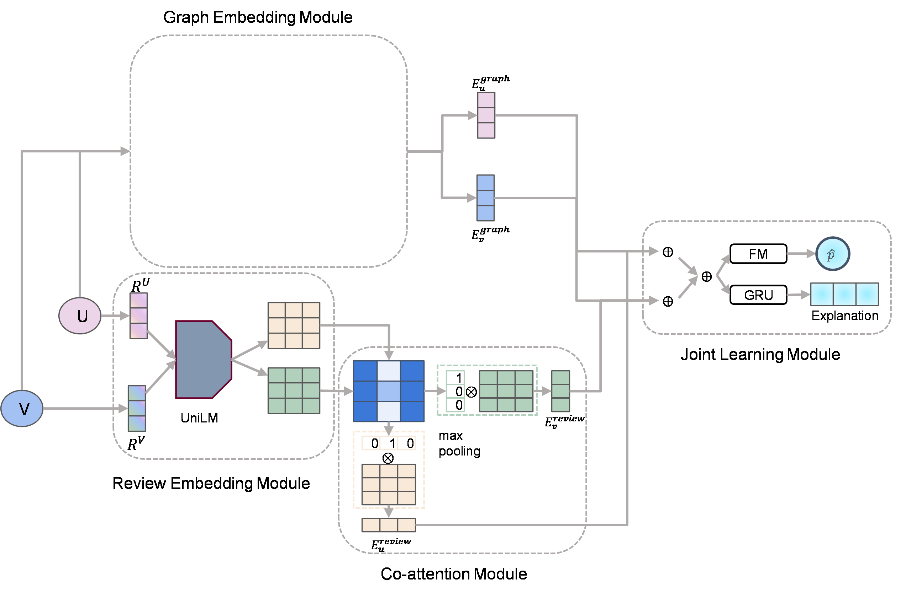

## A Joint Learning Framework for Restaurant Survival Prediction and Explanation. *emnlp 2022*

### Dataset download:

[link of yelp dataset](https://www.yelp.com/dataset)

[link of dianping dataset](http://yongfeng.me/dataset/)

[pre-train UniLM model](https://github.com/zhongerqiandan/pretrained-unilm-Chinese)

 

### requirements:

- tensorflow 1.5
- python 3.6

 

### train:

`python train_CAML.py --rnn_type CAML --opt Adam --emb_size 50 --rnn_size 30 --use_lower 1 --batch-size 128 --allow_growth 1 --dev_lr 0 --rnn_layers 1 --num_proj 1 --dropout 0.8 --epochs 50 --gpu 0 --hdim 30 --lr 0.01 --trainable 1 --eval 1 --dev 1 --num_heads 1 --hard 1 --early_stop 5 --translate_proj 1 --eval_train 0 --dmax 50 --smax 50 --init 0.01 --init_type xavier --att_reuse 0 --gmax 50 --rnn_dim 400 --masking 1 --implicit 1 --average_embed 1 --word_gumbel 1 --data_prepare -1 --word_pooling MEAN --att_type MLP --key_word_lambda 0.25 --word_aggregate MAX --feed_rating 0 --gen_lambda 0.012 --concept 0 --data_link ./data/City_4/clean_n_a_City_4 --len_penalty 2 --beam_size 12 --bert 1 --lba 1`

### test:

`python test_CAML.py --rnn_type CAML --opt Adam --emb_size 50 --rnn_size 30 --use_lower 1 --batch-size 128 --allow_growth 1 --dev_lr 0 --rnn_layers 1 --num_proj 1 --dropout 0.8 --epochs 50 --gpu 0 --hdim 30 --lr 0.001 --trainable 1 --eval 1 --dev 1 --num_heads 1 --hard 1 --early_stop 5 --translate_proj 1 --eval_train 0 --dmax 50 --smax 50 --init 0.01 --init_type xavier --att_reuse 0 --gmax 50 --rnn_dim 400 --masking 1 --implicit 1 --average_embed 1 --word_gumbel 1 --data_prepare -1 --word_pooling MEAN --att_type MLP --key_word_lambda 0.25 --word_aggregate MAX --feed_rating 0 --gen_lambda 0.012 --concept 0 --data_link ./data/City_4/clean_n_a_City_4 --gen_true_dir City4_log/dianping/RAW_MSE_CAML_FN_FM/AZ-bert/expalanation/ --gen_dir City4_log/dianping/RAW_MSE_CAML_FN_FM/AZ-bert/expalanation/ --len_penalty 2 --beam_size 12 --model City4_log/dianping/RAW_MSE_CAML_FN_FM/AZ-bert/model_best.ckpt --bert 1 --lba 1`

### compute_metrics:

`python evaluate/compute_bert_s.py`