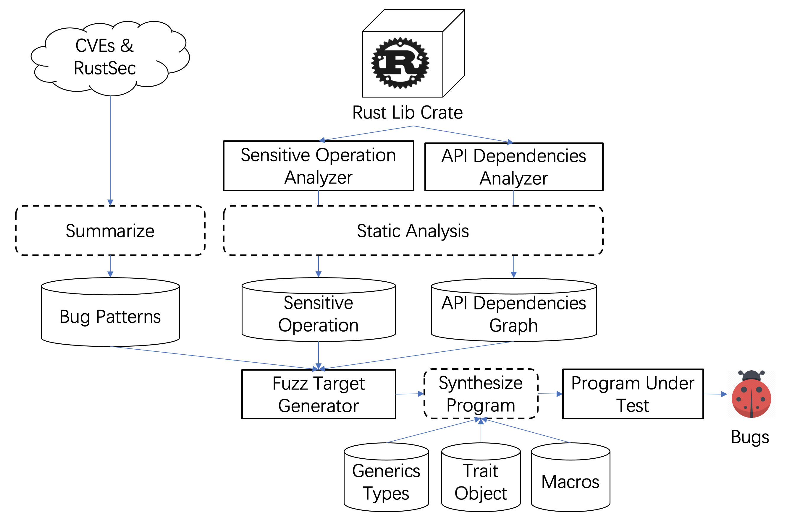

# Hunting Bugs in Rust Library via Testing with Bug-driven Fuzz Driver Synthesis

[](http://opensource.org/licenses/MIT)

----------

## Introudction

This project is our initial efforts to improve the memory safety in Rust ecosystem by automatic testing with bug-driven program synthesis. Here is the initial workflow for this project:

<div align=center>
<figure class="half">
    
</figure>
</div>

New features:
- We have studied the characteristics of memory safety issues in Rust, and summarized several bug patterns.
- We use static analysis to identify sensitive operations in APIs that are likely to lead to memory safety issues.
- The buggy API sequences can be generated via bug-driven program synthesize, based on the API dependency graph, analyzed sensitive operations, and bug patterns.
- Support polymorphic APIs, such as generics types, trait object, and macro APIs.

Readers interested in technical details can refer to our [*technical report*](docs/technical-report.md).


----------

## Install

#### Install the tool dependencies

##### MacOS
HomeBrew (or simply brew) is a popular package manager for MacOs. Install the tool dependencies with: `brew install python3 expect tmux`

##### Ubuntu
Install the tool dependencies with: `sudo apt install python3 expect tmux`

#### Download Our Tool

Clone the repository to a local directory.
```sh
$ git clone https://github.com/SZU-SE/Rust-Lib-Testing.git Rust-Lib-Testing --depth=1
```

#### Download the Rust Compiler Source Code

Note that the compilation depends on external submodules (i.e., [the Rust Compiler Source Code](https://github.com/rust-lang/rust.git)), you also need to synchronize submodules. Try following commands:
```sh
$ cd Rust-Lib-Testing/src
$ git clone -b 1.59.0 https://github.com/rust-lang/rust.git rust --depth 1
$ cd rust
$ git submodule init
$ git submodule update
```

#### Tool Installation (One-click build)

For simplicity, we provide shell script for the whole installation (you must see the "exit 0" on your terminal after the installation)
```
$ scripts/build.sh init
```

----------

## Tool Usage

#### Setup Environmental Variable

You will find a script file `rustGen` in the root directory of the repository. You can add this directory to your environmental variable `$PATH`，or use the following script to quickly set environment variables.
```sh
# Every time you open a new terminal, you need to re-execute this command.
$ source scripts/init_env.sh
```

### Sequence choice

#### Select a Sequence Choice Strategy

You can select a sequence choice strategy by setting `GenChoose` environment variable. Default strategy is `all`. 
```sh
# Currently supported:
# 1. all (choose all sequence)
# 2. naive
# 3. random
# 4. heuristic
# 5. unsafe
# 6. unsafeHeuristic
$ export GenChoose=unsafe
```

#### Select a Sequence Traversal Strategy

You can select a sequence traversal strategy by setting `strategy` environment variable. Default strategy is `bfs`. 
```sh
# Currently supported:
# 1. bfs(origin)
# 2. unsafe
# 3. ubfs
# 4. wubfs
# 5. pattern
$ export Strategy=wubfs
```

#### Compile with Address Sanitizer

You can compile the prgrom with Adress Sanitizer, which helps with finding bugs. Then, nightly symbol is necessary when compiling.
```sh
$ export RUSTFLAGS=-Zsanitizer=address
$ export RUSTDOCFLAGS=-Zsanitizer=address
```

#### Generate Raw API Call Sequences for the Tested Library

In the following, we use the `rust-url` examples in the `tests` folder to explain how to use the tool. If you want to generate fuzz targets for `rust-url`, you can follow below instructions.
```sh
$ cd tests/rust-url
$ rustgen init
```
Then you will get fuzz targets under the folder `tests/rust-url/fuzz_target/url_fuzz`.

#### Generate Compileable Fuzz Targets for [AFL.rs](https://github.com/rust-fuzz/afl.rs)

Next, we deploy the Compileable fuzz targets that can be used by afl.rs. You need to make sure you have correctly install [AFL.rs](https://github.com/rust-fuzz/afl.rs) and [AFL.rs](https://github.com/rust-fuzz/afl.rs) can run properly. You can follow the instructions on [rust-fuzz-book](https://rust-fuzz.github.io/book/afl.html).
```sh
$ cd tests/rust-url
$ rustgen target
```
**[Mac OS Note]**: According to the [issue 858](https://giters.com/AFLplusplus/AFLplusplus/issues/858) of AFLplusplus, MacOS has a ridiculous small default shared memory size. Try `ipcs -m | cut -f2 -d' ' | xargs -I {} sudo ipcrm -m {}; ipcs -m | cut -f3 -d' ' | xargs -I {} sudo ipcrm -m {}` to remove old maps, then `sudo sysctl -w kern.sysv.shmall=65536` and `sudo sysctl -w kern.sysv.shmmax=16777216`.

#### Fuzzing with [AFL.rs](https://github.com/rust-fuzz/afl.rs)

Once you get fuzz targets, you can fuzz these targets with [AFL.rs](https://github.com/rust-fuzz/afl.rs). You can follow the instructions of [AFL.rs](https://rust-fuzz.github.io/book/afl/tutorial.html) on your own. Or use our prepared command line scripts.
```sh
$ cd tests/rust-url
$ rustgen fuzz
```

<!--
### Interpreting the Fuzzing Results

To be continued.
```
fuzzer_scripts -t url      #reduce test file size
fuzzer_scripts -cmin url   #reduce test file number
fuzzer_scripts -s url      #output statistic info
fuzzer_scripts -r url      #replay crash files
```
-->

----------
