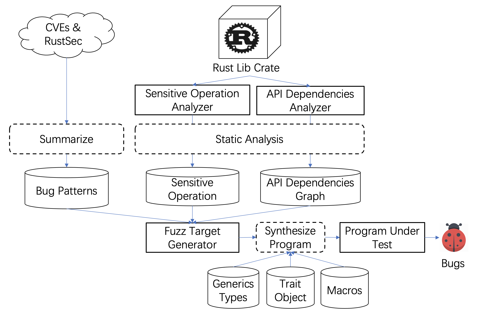

# Hunting Bugs in Rust Library via Testing with Bug-driven Fuzz Driver Synthesis

----------

## Introudction

This project is our initial efforts to improve the memory safety bug in Rust ecosystem by automatic testing with bug-driven program synthesis. Here is the initial workflow for this project:

We try to make the following new features:
- We have studied the characteristics of memory safety issues in Rust, and summarized several bug patterns.
- We use static analysis to identify sensitive operations in APIs that are likely to lead to memory safety issues.
- The buggy API sequences can be explored via bug-driven program synthesize, based on analyzed sensitive operations and bug patterns.
- Support polymorphic APIs, such as generics types, trait object, and macro APIs.


----------

## Overview

### Motivating example

```rust
impl<T, ...> Queue<T, ...> {
    fn new() -> Self {...}
    fn push(&mut self, item: T) {...}
    pub fn pop(&self) -> Option<T> {unsafe {...}}
    pub fn peek(&self) -> Option<&mut T> {unsafe {...}}
}
```

```rust
// POC
fn main() {
    let mut q: Queue<String> = Queue::new();
    q.push(String::from("hello"));
    let e = q.peek().unwrap();
    q.pop();
    println!("{}", *e); // <- use after free
}
```

Full version: [Permalink to the playground](https://play.rust-lang.org/?version=stable&mode=debug&edition=2018&gist=69c1d4c4901f7991e9e204c14cd52d1d)

<div align=center>
<figure class="half">
    
    
</figure>
</div>


### Solution

<div align=center>
<figure class="half">
    
</figure>
</div>

----------

## Methodology

<div align=center>
<figure class="half">
    
</figure>
</div>

----------


## Related Work

**Testing of Rust programs.** Some recent work has begun to focus on automatically generating tests for rust libraries. SyRust[<sup>1</sup>](#refer-anchor-1) is a testing framework for Rust libraries. SyRust synthesizes large numbers of programs for a small set of library APIs and does not mutate the input value of each program. RULF[<sup>2</sup>](#refer-anchor-2) is an automated fuzz target generation approach for Rust library fuzzing based on API dependency graph traversal. RULF employs BFS with pruning and backward search to generate valid API sequences and refines the sequences to obtain an optimal sequence set.

Some works propose for testing of Rust executable program instead of libraries. Cago-fuzz[<sup>3</sup>](#refer-anchor-3) and Afl.rs[<sup>4</sup>](#refer-anchor-4) are two tools for fuzzing Rust code, allowing one to run libfuzzer[<sup>5</sup>](#refer-anchor-5) and AFL[<sup>6</sup>](#refer-anchor-6) on code written in the Rust programming language. RUSTY[<sup>7</sup>](#refer-anchor-7) is a another Fuzzing Tool for Rust, which perform bug fuzzing based on the combination of concolic testing and property-based testing. UnsafeFencer[<sup>8</sup>](#refer-anchor-8) is a practical hybrid approach to detecting unsafe raw pointer dereferencing behaviors. UnsafeFencer employs pattern matching to identify functions that can be used to generate illegal multiple mutable references (define them as thief function) and instruments the dereferencing operation in order to perform dynamic checking at runtime. Miri[<sup>9</sup>](#refer-anchor-9) is an experimental interpreter for Rust's mid-level intermediate representation (MIR). It can run binaries and test suites of cargo projects and detect certain classes of undefined behavior, which is widely used in industry.

**Static Analysis of Rust programs.** To build a foundation of soundness in the Rust ecosystem, there has been a large body of research projects in formalizing Rust’s type system and operational semantics[<sup>10</sup>](#refer-anchor-10)<sup>-</sup>[<sup>16</sup>](#refer-anchor-16), in verifying its correctness[<sup>17</sup>](#refer-anchor-17)<sup>,</sup>[<sup>19</sup>](#refer-anchor-19), and in model checking[<sup>20</sup>](#refer-anchor-20)<sup>,</sup>[<sup>21</sup>](#refer-anchor-21). RustBelt[<sup>10</sup>](#refer-anchor-10) is the first formal tool for verifying the safe encapsulation of unsafe code in Rust. XRust[<sup>16</sup>](#refer-anchor-16) is a heap allocator that isolates the memory of unsafe Rust and prevents any cross-region memory corruption. RustBelt, XRust and other researchs[<sup>11</sup>](#refer-anchor-11) based on them separate processing safe Rust and unsafe Rust to enhance memory safety. Stacked Borrows[<sup>12</sup>](#refer-anchor-12) is used as a correctness model in Miri[<sup>9</sup>](#refer-anchor-9), a component in SyRust to detect unsound behaviors.

Many recent work try to apply static analysis of Rust programs practical enough to scale to the entire ecosystem. SafeDrop[<sup>22</sup>](#refer-anchor-22) is a novel compiler-integrated path-sensitive data-flow approach to detect memory deallocation violations in Rust. SafeDrop analyzes each API of a Rust crate iteratively by traversing the control-flow graph and extracting all aliases of each data-flow. Rudra[<sup>23</sup>](#refer-anchor-11) is a static analyzer that analyzes and reports potential memory safety bugs in unsafe Rust code. Rudra can identify three bug patterns in unsafe and employ two algorithms to automatically find bugs at the ecosystem scale.

**Automatic fuzz driver generation.** There have been some work into automated fuzz driver generation. Google recently proposed a framework FUDGE[<sup>24</sup>](#refer-anchor-24) to generate fuzzerivers semi-automatically. FUDGE constructs fuzz drivers by scanning the program’s source code to find vulnerable function calls and generates fuzz drivers using parameter replacement. It works well in specific scenarios but tends to generate excessive fuzz drivers for large projects which require manual removal of invalid results. Furthermore, it is infeasible to try all candidate drivers. Another example would be FuzzGen[<sup>25</sup>](#refer-anchor-25), which leverages a whole system analysis to infer the library’s interface and synthesize fuzz drivers based on existing test cases accordingly. Its performance relies heavily upon the quality of existing test cases. IntelliGen[<sup>26</sup>](#refer-anchor-26) first determines a set of entry functions and evaluates their respective chance of exhibiting a vulnerability. Then, IntelliGen generates fuzz drivers for the entry functions through hierarchical parameter replacement and type inference. APICraft[<sup>27</sup>](#refer-anchor-27) is a novel technique for fuzz driver generation for closed-source SDK libraries. The key strategy of APICRAFT is called collect–combine. First, APICRAFT collects the dependencies of API functions. Then, it combines the collected dependencies with a multiobjective genetic algorithm to build semantically meaningful and diverse fuzz drivers. RESTler[<sup>28</sup>](#refer-anchor-28)<sup>,</sup>[<sup>29</sup>](#refer-anchor-29) is another work that generates fuzz targets for RESTful APIs, and it is based on BFS. WINNIE[<sup>30</sup>](#refer-anchor-30) aims to fuzz closed-source libraries on Windows via fuzz driver generation and fast-cloning of processes. However, These approaches do not have strong type requirements as Rust. Since these works are for C/C++, lifetime and ownership is not an issue.

**Advanced fuzzing techniques** Fuzzing has become a well-recognized vulnerability detection technique[<sup>31</sup>](#refer-anchor-31)<sup>-</sup>[<sup>33</sup>](#refer-anchor-33). A lot of research efforts have been devoted to improving both the efficiency and effectiveness of fuzzers in recent years[<sup>34</sup>](#refer-anchor-34)<sup>-</sup>[<sup>40</sup>](#refer-anchor-40). These techniques are orthogonal to our work since the fuzz drivers generated by out tool can be supplied to any fuzzing technique.


----------

## Conclusion

To be continued.

----------

## Reference

<div id="refer-anchor-1"></div>
[1] Takashima Y, Goncalves Martins R C, Jia L, et al. SyRust: Automatic Testing of Rust Libraries with Semantic-Aware Program Synthesis–Technical Report[J]. 2021.
<div id="refer-anchor-2"></div>
[2] Jiang J, Xu H, Zhou Y. RULF: Rust Library Fuzzing via API Dependency Graph Traversal[J]. arXiv preprint arXiv:2104.12064, 2021.
<div id="refer-anchor-3"></div>
[3] Command line helpers for fuzzing Rust programs: https://github.com/rust-fuzz/cargo-fuzz
<div id="refer-anchor-4"></div>
[4] Afl.rs allows one to run AFL on code written in the Rust programming language: https://rust-fuzz.github.io/book/afl/tutorial.html
<div id="refer-anchor-5"></div>
[5] Zalewski M. American fuzzy lop[J]. 2014.
<div id="refer-anchor-6"></div>
[6] Serebryany K. libFuzzer–a library for coverage-guided fuzz testing[J]. LLVM project, 2015.
<div id="refer-anchor-7"></div>
[7] Ashouri M. RUSTY: A Fuzzing Tool for Rust[J].
<div id="refer-anchor-8"></div>
[8] Huang Z, Wang Y J, Liu J. Detecting unsafe raw pointer dereferencing behavior in rust[J]. IEICE TRANSACTIONS on Information and Systems, 2018, 101(8): 2150-2153.
<div id="refer-anchor-9"></div>
[9] Jung J, Tong S, Hu H, et al. WINNIE: Fuzzing Windows Applications with Harness Synthesis and Fast Cloning[C]//Proceedings of the 2021 Annual Network and Distributed System Security Symposium (NDSS), Virtual. 2021.
<div id="refer-anchor-10"></div>
[10] Jung R, Jourdan J H, Krebbers R, et al. RustBelt: Securing the foundations of the Rust programming language[J]. Proceedings of the ACM on Programming Languages, 2017, 2(POPL): 1-34.
<div id="refer-anchor-11"></div>
[11] Dang H H, Jourdan J H, Kaiser J O, et al. RustBelt meets relaxed memory[J]. Proceedings of the ACM on Programming Languages, 2019, 4(POPL): 1-29.
<div id="refer-anchor-12"></div>
[12] Jung R, Dang H H, Kang J, et al. Stacked borrows: an aliasing model for Rust[J]. Proceedings of the ACM on Programming Languages, 2019, 4(POPL): 1-32.
<div id="refer-anchor-13"></div>
[13] Reed E. Patina: A formalization of the Rust programming language[J]. University of Washington, Department of Computer Science and Engineering, Tech. Rep. UW-CSE-15-03-02, 2015: 264.
<div id="refer-anchor-14"></div>
[14] Wang F, Song F, Zhang M, et al. Krust: A formal executable semantics of rust[C]//2018 International Symposium on Theoretical Aspects of Software Engineering (TASE). IEEE, 2018: 44-51.
<div id="refer-anchor-15"></div>
[15] Weiss A, Gierczak O, Patterson D, et al. Oxide: The essence of rust[J]. arXiv preprint arXiv:1903.00982, 2019.
<div id="refer-anchor-16"></div>
[16] Liu P, Zhao G, Huang J. Securing unsafe rust programs with XRust[C]//Proceedings of the ACM/IEEE 42nd International Conference on Software Engineering. 2020: 234-245.
<div id="refer-anchor-17"></div>
[17] Astrauskas V, Müller P, Poli F, et al. Leveraging Rust types for modular specification and verification[J]. Proceedings of the ACM on Programming Languages, 2019, 3(OOPSLA): 1-30.
<div id="refer-anchor-18"></div>
[18] Müller P, Schwerhoff M, Summers A J. Viper: A verification infrastructure for permission-based reasoning[C]//International conference on verification, model checking, and abstract interpretation. Springer, Berlin, Heidelberg, 2016: 41-62.
<div id="refer-anchor-19"></div>
[19] Baranowski M, He S, Rakamarić Z. Verifying Rust programs with SMACK[C]//International Symposium on Automated Technology for Verification and Analysis. Springer, Cham, 2018: 528-535.
<div id="refer-anchor-20"></div>
[20] Toman J, Pernsteiner S, Torlak E. Crust: a bounded verifier for rust (N)[C]//2015 30th IEEE/ACM International Conference on Automated Software Engineering (ASE). IEEE, 2015: 75-80.
<div id="refer-anchor-21"></div>
[21] Matsushita Y, Tsukada T, Kobayashi N. RustHorn: CHC-based verification for Rust programs[C]//European Symposium on Programming. Springer, Cham, 2020: 484-514.
<div id="refer-anchor-22"></div>
[22] Bae Y, Kim Y, Askar A, et al. Rudra: Finding Memory Safety Bugs in Rust at the Ecosystem Scale[C]//Proceedings of the ACM SIGOPS 28th Symposium on Operating Systems Principles CD-ROM. 2021: 84-99.
<div id="refer-anchor-23"></div>
[23] Cui M, Chen C, Xu H, et al. SafeDrop: Detecting Memory Deallocation Bugs of Rust Programs via Static Data-Flow Analysis[J]. arXiv preprint arXiv:2103.15420, 2021.
<div id="refer-anchor-24"></div>
[24] Babić D, Bucur S, Chen Y, et al. Fudge: fuzz driver generation at scale[C]//Proceedings of the 2019 27th ACM Joint Meeting on European Software Engineering Conference and Symposium on the Foundations of Software Engineering. 2019: 975-985.
<div id="refer-anchor-25"></div>
[25] Ispoglou K, Austin D, Mohan V, et al. Fuzzgen: Automatic fuzzer generation[C]//29th USENIX Security Symposium (USENIX Security 20). 2020: 2271-2287.
<div id="refer-anchor-26"></div>
[26] Zhang M, Liu J, Ma F, et al. IntelliGen: Automatic Driver Synthesis for Fuzz Testing[C]//2021 IEEE/ACM 43rd International Conference on Software Engineering: Software Engineering in Practice (ICSE-SEIP). IEEE, 2021: 318-327.
<div id="refer-anchor-27"></div>
[27] Zhang C, Lin X, Li Y, et al. APICraft: Fuzz Driver Generation for Closed-source {SDK} Libraries[C]//30th USENIX Security Symposium (USENIX Security 21). 2021: 2811-2828.
<div id="refer-anchor-28"></div>
[28] Atlidakis V, Godefroid P, Polishchuk M. Restler: Stateful rest api fuzzing[C]//2019 IEEE/ACM 41st International Conference on Software Engineering (ICSE). IEEE, 2019: 748-758.
<div id="refer-anchor-29"></div>
[29] Godefroid P, Huang B Y, Polishchuk M. Intelligent REST API data fuzzing[C]//Proceedings of the 28th ACM Joint Meeting on European Software Engineering Conference and Symposium on the Foundations of Software Engineering. 2020: 725-736.
<div id="refer-anchor-30"></div>
[30] Jung J, Tong S, Hu H, et al. WINNIE: Fuzzing Windows Applications with Harness Synthesis and Fast Cloning[C]//Proceedings of the 2021 Annual Network and Distributed System Security Symposium (NDSS), Virtual. 2021.
<div id="refer-anchor-31"></div>
[31] Godefroid P. Fuzzing: Hack, art, and science[J]. Communications of the ACM, 2020, 63(2): 70-76.
<div id="refer-anchor-32"></div>
[32] Manès V J M, Han H S, Han C, et al. The art, science, and engineering of fuzzing: A survey[J]. IEEE Transactions on Software Engineering, 2019.
<div id="refer-anchor-33"></div>
[33] Li J, Zhao B, Zhang C. Fuzzing: a survey[J]. Cybersecurity, 2018, 1(1): 1-13.
<div id="refer-anchor-34"></div>
[34] Liang J, Chen Y, Wang M, et al. Engineering a better fuzzer with synergically integrated optimizations[C]//2019 IEEE 30th International Symposium on Software Reliability Engineering (ISSRE). IEEE, 2019: 82-92.
<div id="refer-anchor-35"></div>
[35] Wang M, Liang J, Chen Y, et al. SAFL: increasing and accelerating testing coverage with symbolic execution and guided fuzzing[C]//Proceedings of the 40th International Conference on Software Engineering: Companion Proceeedings. 2018: 61-64.
<div id="refer-anchor-36"></div>
[36] Fioraldi A, Maier D, Eißfeldt H, et al. AFL++: Combining incremental steps of fuzzing research[C]//14th {USENIX} Workshop on Offensive Technologies ({WOOT} 20). 2020.
<div id="refer-anchor-37"></div>
[37] Wen C, Wang H, Li Y, et al. Memlock: Memory usage guided fuzzing[C]//Proceedings of the ACM/IEEE 42nd International Conference on Software Engineering. 2020: 765-777.
<div id="refer-anchor-38"></div>
[38] Wang H, Xie X, Li Y, et al. Typestate-guided fuzzer for discovering use-after-free vulnerabilities[C]//2020 IEEE/ACM 42nd International Conference on Software Engineering (ICSE). IEEE, 2020: 999-1010.
<div id="refer-anchor-39"></div>
[39] Chen H, Guo S, Xue Y, et al. {MUZZ}: Thread-aware grey-box fuzzing for effective bug hunting in multithreaded programs[C]//29th USENIX Security Symposium (USENIX Security 20). 2020: 2325-2342.
<div id="refer-anchor-40"></div>
[40] Lyu C, Ji S, Zhang C, et al. {MOPT}: Optimized mutation scheduling for fuzzers[C]//28th USENIX Security Symposium (USENIX Security 19). 2019: 1949-1966.